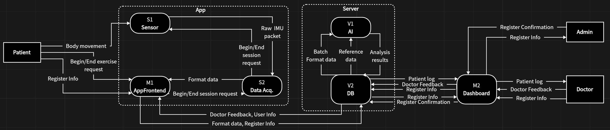

# Total Interface Specification v1.0

Project: Limb Motion Recognition and Assistant
Programme: DSD 2025-2026
Partners: UTAD x Jilin University
Date: May 3, 2026
Author: Zhiqi ZHANG

---

## 1. Overview

This document is the consolidated, post-negotiation interface specification for all cross-team data exchanges in the system. All conflicts identified during the integration phase have been resolved (see Total SD Conflicts and Solutions for details).

### 1.1 System Data Flow Diagram



The overall architecture follows a design where all teams interact through two central hubs: **S2** (on the App/device side) and **V2** (on the Server side). There is no direct interface between S2 and V2; instead, M1 acts as the intermediary for all App-to-Server data transfers. This concentrates interfaces around S2 and V2, making integration straightforward.

**App side (same device):**
- S1 (Sensor) provides raw IMU data to S2
- S2 (Data Acq.) processes data and delivers formatted data to M1
- M1 (AppFrontend) manages session control with S2 and handles all communication with the Server

**Server side (cross-device, HTTP REST):**
- V2 (DB) is the central backend; all other teams communicate with V2
- V1 (AI) exchanges batch format data, reference data, and analysis results with V2
- M1 sends format data and register info to V2 and receives user info and doctor feedback
- M2 (Dashboard) exchanges patient logs, doctor feedback, register info, and register confirmation with V2

### 1.2 Interface Summary

| ID | From | To | Data Flow | Transport |
|----|------|----|-----------|-----------|
| IF-S1-S2 | S1 (Sensor) | S2 | Raw IMU packet | Function call |
| IF-S2-S1 | S2 | S1 (Sensor) | Begin/End session request | Function call |
| IF-M1-S2 | M1 (AppFrontend) | S2 | Begin/End session request | Function call |
| IF-S2-M1 | S2 | M1 (AppFrontend) | Format data | Function call |
| IF-M1-V2 | M1 | V2 (DB) | Format data, Register Info | HTTP REST API |
| IF-V2-M1 | V2 (DB) | M1 | User Info, Doctor Feedback | HTTP REST API |
| IF-V1-V2 | V1 (AI) | V2 (DB) | Analysis results | HTTP REST API |
| IF-V2-V1 | V2 (DB) | V1 (AI) | Batch Format data, Reference data | HTTP REST API |
| IF-M2-V2 | M2 (Dashboard) | V2 (DB) | Doctor Feedback, Register Info, Register Confirmation | HTTP REST API |
| IF-V2-M2 | V2 (DB) | M2 (Dashboard) | Patient log, Register Info | HTTP REST API |

---

## 2. IF-S2: App-Side Interfaces

All interfaces in this section are on the same device (App side), using function calls.

### 2.1 IF-S1-S2: Raw IMU Packet

| Attribute | Value |
|-----------|-------|
| Dataflow direction | S1 -> S2 |
| Cross-device | No (same device) |
| Transport | Function call |
| Service provider | S1 |
| Service user | S2 |

#### 2.1.1 `s1.sensor.read()`

Read a batch of IMU samples collected since the last call.

- **Parameters:** None
- **Returns:** *List[SensorSample]* (may be empty if no new data is available)

Example:
```
samples = s1.sensor.read()
for s in samples:
    print(s.timestamp, s.roll, s.pitch, s.yaw)
```

#### 2.1.2 `s1.sensor.status()`

Query the current status of the sensor hardware connection.

- **Parameters:** None
- **Returns:** *SensorStatus*

Example:
```
st = s1.sensor.status()
if not st.connected:
    print("Sensor error:", st.errorMessage)
```

#### 2.1.3 class *SensorSample*

A single IMU sensor reading at one point in time.

- **timestamp** (*int*): Unix timestamp in milliseconds.
- **deviceId** (*str*): Unique sensor device identifier.
- **deviceName** (*str*): Human-readable sensor name (e.g. "WTL1").
- **accX, accY, accZ** (*float*): Accelerometer, in g.
- **gyroX, gyroY, gyroZ** (*float*): Gyroscope, in deg/s.
- **roll, pitch, yaw** (*float*): Orientation angles, in degrees.

#### 2.1.4 class *SensorStatus*

Current state of the sensor connection.

- **connected** (*bool*): True if sensor is connected and producing data.
- **errorMessage** (*str or None*): Error description if in error state. Possible values: "sensor_disconnected", "data_corruption", "timeout".

---

### 2.2 IF-S2-S1: Begin/End Session Request

| Attribute | Value |
|-----------|-------|
| Dataflow direction | S2 -> S1 |
| Cross-device | No (same device) |
| Transport | Function call |
| Service provider | S1 |
| Service user | S2 |

S2 calls S1's session start/end methods to control raw data collection. Defined in SRS use cases IUC-S2-03-01 and IUC-S2-03-02.

#### 2.2.1 `s1.session.start(sessionMetaData)`

Start raw data collection on S1.

- **Parameters:**
  - **sessionMetaData** (*dict*): Session meta data including rehabilitation training category, etc.
- **Returns:** Confirmation signal on success; error signal on failure.

#### 2.2.2 `s1.session.stop()`

Stop raw data collection on S1.

- **Parameters:** None
- **Returns:** Confirmation signal on success; error signal on failure.

---

### 2.3 IF-M1-S2: Begin/End Session Request

| Attribute | Value |
|-----------|-------|
| Dataflow direction | M1 -> S2 |
| Cross-device | No |
| Transport | Function call |
| Service provider | S2 |
| Service user | M1 |

#### 2.3.1 `s2.session.start(sessionId, userId, sensorJointMapping, payloadStatus)`

Start a data acquisition session. S2 begins reading sensor data from S1, validating, buffering, and delivering to M1.

- **Parameters:**
  - **sessionId** (*int*): Session identifier, server-generated by V2. MUST be valid.
  - **userId** (*int*): User identifier, referencing the V2 users table. MUST be valid.
  - **sensorJointMapping** (*dict, optional*): Mapping from sensor device ID to joint name. E.g. `{"1IYw...": "left_knee", "xR3f...": "right_elbow"}`. Fixed for the entire session.
  - **payloadStatus** (*str*): Exercise/task type for this session (e.g. "bend_knee_10"). Fixed for the entire session.
- **Returns:** *StartResult*
- **Raises:** *ValueError* if required parameters are invalid.

Example:
```
result = s2.session.start(
    1, 1,
    {"1IYw...": "left_knee", "xR3f...": "right_elbow"},
    "bend_knee_10"
)
if result.success:
    print("Acquisition started")
```

#### 2.3.2 `s2.session.stop()`

Stop the current session. S2 flushes remaining buffered data, then enters idle state.

- **Parameters:** None
- **Returns:** *SessionSummary*
- **Raises:** *RuntimeError* if no session is active.

#### 2.3.3 class *StartResult*

- **success** (*bool*): Whether the session started successfully.
- **errorMessage** (*str or None*): Reason for failure. Possible values: "session_already_active", "sensor_not_connected".

#### 2.3.4 class *SessionSummary*

- **sessionId** (*int*): Identifier of the closed session.
- **sampleCount** (*int*): Total valid samples collected.
- **errorCount** (*int*): Total rejected samples.
- **startTime** (*str*): Session start timestamp (ISO 8601).
- **endTime** (*str*): Session end timestamp (ISO 8601).

---

### 2.4 IF-S2-M1: Format Data

| Attribute | Value |
|-----------|-------|
| Dataflow direction | S2 -> M1 |
| Cross-device | No |
| Transport | Function call |
| Service provider | S2 |
| Service user | M1 |

#### 2.4.1 `s2.data.read()`

Read all Format data accumulated since the last call. Returns a *FormatData* object containing three asynchronous data lists (sensor readings, target angles, and error events), plus the session context set at session start.

- **Parameters:** None
- **Returns:** *FormatData*
- **Notes:** The three lists in *FormatData* are **asynchronous**: they may have different lengths on each call, because each sensor samples independently and target angle computation runs at its own rate.

Example:
```
data = s2.data.read()
for s in data.sensorData:
    print(s.timestamp, s.deviceId, s.roll, s.pitch, s.yaw)
for t in data.targetAngles:
    print(t.timestamp, t.angle)
```

#### 2.4.2 class *FormatData*

Output data structure of S2.

- **sessionContext** (*SessionContext*): Session-level info, fixed for the entire session.
- **sensorData** (*List[SensorSample]*): Validated sensor readings from all sensors since last read. Uses *SensorSample* defined in 2.1.3.
- **targetAngles** (*List[TargetAngle]*): Target angles computed by S2 core since last read.
- **errors** (*List[ErrorEvent]*): Error events since last read.

#### 2.4.3 class *SessionContext*

- **sessionId** (*int*): Session identifier, server-generated by V2.
- **userId** (*int*): User identifier, referencing the V2 users table.
- **sensorJointMapping** (*dict*): Sensor device ID -> joint name mapping.
- **payloadStatus** (*str*): Exercise/task type (e.g. "bend_knee_10").

#### 2.4.4 class *TargetAngle*

- **timestamp** (*int*): Unix timestamp in milliseconds when computed.
- **angleID** (*str*): Angle identifier.
- **angle** (*float*): Computed target angle, in degrees.

#### 2.4.5 class *ErrorEvent*

- **timestamp** (*int*): Unix timestamp in milliseconds.
- **sensorId** (*str or None*): Sensor that caused the error, or None if not sensor-specific.
- **errorType** (*str*): "sensor_disconnected", "validation_failure", "timeout".
- **message** (*str*): Human-readable error description.

---

## 3. IF-V2: Server-Side Interfaces

All interfaces in this section go through V2's HTTP REST API.

**API to Interface Mapping:**

| API | IF-M1-V2 | IF-V2-M1 | IF-V1-V2 | IF-V2-V1 | IF-M2-V2 | IF-V2-M2 |
|-----|----------|----------|----------|----------|----------|----------|
| `POST /auth/register` | ✓ | | | | ✓ | |
| `POST /auth/login` | ✓ | | | | ✓ | |
| `GET /auth/me` | | ✓ | | | | ✓ |
| `GET /users/:id` | | ✓ | | | | ✓ |
| `POST /sessions` | ✓ | | | | | |
| `GET /sessions/:id` | | ✓ | | | | ✓ |
| `PATCH /sessions/:id/end` | ✓ | | | | | |
| `DELETE /sessions/:id` | | | | | ✓ | |
| `POST /measurements` | ✓ | | | | | |
| `POST /measurements/batch` | ✓ | | | | | |
| `GET /measurements/:sessionId` | | ✓ | | ✓ | | ✓ |
| `POST /recommendations` | | | ✓ | | | |
| `GET /recommendations/session/:sessionId` | | ✓ | | | | ✓ |
| `GET /recommendations/engine/:userId` | | ✓ | | | | ✓ |
| `PATCH /recommendations/:id` | | | | | ✓ | |
| `POST /schedule` | | | | | ✓ | |
| `GET /schedule/:userId` | | ✓ | | | | ✓ |
| `PATCH /schedule/:id` | ✓ | | | | ✓ | |
| `DELETE /schedule/:id` | | | | | ✓ | |
| `POST /push/register` | ✓ | | | | | |
| `GET /push/tokens/:userId` | | | | | | ✓ |

**Base URL:** `https://dsd2026-teamv2-production.up.railway.app`

**General rules:**
- All request bodies are JSON (`Content-Type: application/json`), unless otherwise specified
- All responses are JSON
- Request field naming: **camelCase**
- Response field naming: **snake_case**
- Timestamps: **ISO 8601** (e.g. `"2026-05-02T13:43:38.549Z"`)
- Authentication: JWT token via `Authorization: Bearer <token>` header (where required)

### 3.1 Authentication

Used by: M1, M2

#### 3.1.1 `POST /auth/register`

Register a new user account.

**Request body:**
```json
{
  "name": "Ana Costa",
  "email": "ana@utad.pt",
  "password": "123456",
  "role": "patient"
}
```

`role` must be `"patient"` or `"clinician"` (default: `"patient"`).

**Response (201):**
```json
{
  "token": "jwt-token-string",
  "user": {
    "id": 1,
    "name": "Ana Costa",
    "email": "ana@utad.pt",
    "role": "patient",
    "created_at": "2026-05-02T13:43:28.000Z"
  }
}
```

**Note:** For doctor registration, M2 requires an optional `license` file upload and approval workflow. This is pending V2 implementation (see Total SD Conflicts and Solutions, Chapter 8, Conflicts 2-3).

#### 3.1.2 `POST /auth/login`

Log in with existing credentials.

**Request body:**
```json
{
  "email": "ana@utad.pt",
  "password": "123456"
}
```

**Response (200):**
```json
{
  "token": "jwt-token-string",
  "user": {
    "id": 1,
    "name": "Ana Costa",
    "email": "ana@utad.pt",
    "role": "patient",
    "created_at": "2026-05-02T13:43:28.000Z"
  }
}
```

#### 3.1.3 `GET /auth/me`

Get current authenticated user info. Requires `Authorization: Bearer <token>` header.

**Response (200):**
```json
{
  "id": 1,
  "name": "Ana Costa",
  "email": "ana@utad.pt",
  "role": "patient",
  "created_at": "2026-05-02T13:43:28.000Z"
}
```

---

### 3.2 Users

Used by: M1, M2

#### 3.2.1 `GET /users/:id`

Get user by ID.

**Response (200):**
```json
{
  "id": 1,
  "name": "Ana Costa",
  "email": "ana@utad.pt",
  "role": "patient",
  "created_at": "2026-05-02T13:43:28.000Z",
  "session_count": 3
}
```

**Note:** `POST /users` is a legacy endpoint (no password, no JWT). Use `POST /auth/register` instead.

**Note:** M2 requires `GET /patients` (list all users with role=patient) and `GET /patients/:id` endpoints, with an `age` field in patient data. These are pending V2 implementation (see Total SD Conflicts and Solutions, Chapter 8, Conflict 7).

---

### 3.3 Sessions

Used by: M1, M2

#### 3.3.1 `POST /sessions`

Create a new rehabilitation session.

**Request body:**
```json
{
  "userId": 1
}
```

**Response (201):**
```json
{
  "id": 1,
  "user_id": 1,
  "user_name": "Ana Costa",
  "started_at": "2026-05-02T13:43:35.000Z",
  "ended_at": null
}
```

#### 3.3.2 `GET /sessions/:id`

Get session details with all measurements inline.

**Response (200):**
```json
{
  "id": 1,
  "user_id": 1,
  "user_name": "Ana Costa",
  "user_email": "ana@utad.pt",
  "started_at": "2026-05-02T13:43:35.000Z",
  "ended_at": null,
  "measurements": [
    {
      "id": 1,
      "session_id": 1,
      "target_angles": [
        {"timestamp": "2026-05-02T13:43:38.549Z", "angle_id": "knee", "angle": 45.2}
      ],
      "errors": [],
      "sensor_data": []
    }
  ]
}
```

#### 3.3.3 `PATCH /sessions/:id/end`

End an active session. No request body required; server sets `ended_at` automatically.

**Response (200):**
```json
{
  "id": 1,
  "user_id": 1,
  "started_at": "2026-05-02T13:43:35.000Z",
  "ended_at": "2026-05-02T13:43:52.000Z"
}
```

#### 3.3.4 `DELETE /sessions/:id`

Delete a session.

**Response:** 204 No Content

---

### 3.4 Measurements

Used by: M1 (upload), M2 (read), V1 (read)

Per the IF-S2-V2 Conflict 4 resolution, V2 accepts the negotiated format based on S2's design (targetAngles + sensorData + errors), replacing the original jointAngles + isCorrect format.

#### 3.4.1 `POST /measurements`

Add a single measurement to an active session. Requires authentication (login first to obtain JWT token).

**Request body:**
```json
{
  "sessionId": 1,
  "targetAngles": [
    {"timestamp": "2026-05-02T13:43:38.549Z", "angleID": "knee", "angle": 45.2},
    {"timestamp": "2026-05-02T13:43:38.580Z", "angleID": "hip", "angle": 30.1}
  ],
  "errors": [],
  "sensorData": [
    {
      "timestamp": "2026-05-02T13:43:38.549Z",
      "sensorId": "1IYwPyBcytYa9htYB0LOJQ==",
      "accX": 0.2266, "accY": 0.2915, "accZ": 0.9668,
      "gyroX": 0.0, "gyroY": 3.11, "gyroZ": -0.73,
      "roll": 15.57, "pitch": -13.78, "yaw": -144.01
    }
  ]
}
```

`errors` and `sensorData` are optional fields.

**Response (201):** Stored measurement object.

**Error responses:**
- 409 Conflict: Session is closed

#### 3.4.2 `POST /measurements/batch`

Add multiple measurements at once. Requires authentication (login first to obtain JWT token).

**Request body:**
```json
{
  "sessionId": 1,
  "measurements": [
    {
      "targetAngles": [
        {"timestamp": "2026-05-02T13:43:38.549Z", "angleID": "knee", "angle": 45.2}
      ],
      "errors": [],
      "sensorData": []
    },
    {
      "targetAngles": [
        {"timestamp": "2026-05-02T13:43:38.582Z", "angleID": "knee", "angle": 38.0}
      ],
      "errors": [],
      "sensorData": []
    }
  ]
}
```

**Response (201):**
```json
{
  "inserted": 2,
  "sessionId": 1
}
```

#### 3.4.3 `GET /measurements/:sessionId`

Get all measurements for a session.

**Response (200):**
```json
[
  {
    "id": 1,
    "session_id": 1,
    "target_angles": [
      {"timestamp": "2026-05-02T13:43:38.549Z", "angle_id": "knee", "angle": 45.2}
    ],
    "errors": [],
    "sensor_data": [],
    "timestamp": "2026-05-02T13:43:38.549Z"
  }
]
```

**Note:** Response uses snake_case per V2 convention. M2 requires date range filtering (e.g. `?startDate=...&endDate=...`). This is pending V2 implementation (see Total SD Conflicts and Solutions, Chapter 8, Conflict 8).

---

### 3.5 Recommendations

Used by: V1 (create), M1 (read), M2 (read, update)

#### 3.5.1 `POST /recommendations`

Create a recommendation.

**Request body:**
```json
{
  "sessionId": 1,
  "movement": "knee flexion",
  "confidence": 0.87,
  "status": "pending"
}
```

`confidence` is a float between 0.0 and 1.0. `status` must be "pending", "accepted", or "rejected" (default: "pending").

**Note:** M2 requests an optional `notes` field for doctor comments. This is pending V2 implementation (see Total SD Conflicts and Solutions, Chapter 8, Conflict 5).

**Response (201):**
```json
{
  "id": 1,
  "session_id": 1,
  "movement": "knee flexion",
  "confidence": 0.87,
  "status": "pending",
  "created_at": "2026-05-02T13:43:41.000Z"
}
```

#### 3.5.2 `GET /recommendations/session/:sessionId`

Get recommendations for a specific session.

**Response (200):**
```json
[
  {
    "id": 1,
    "session_id": 1,
    "movement": "knee flexion",
    "confidence": 0.87,
    "status": "pending",
    "created_at": "2026-05-02T13:43:41.000Z"
  }
]
```

#### 3.5.3 `GET /recommendations/engine/:userId`

Auto-analysis across last 10 sessions of a user.

**Response (200):**
```json
{
  "userId": 1,
  "sessions_analysed": 5,
  "generated_at": "2026-05-02T13:43:44.670Z",
  "suggestions": [
    {
      "joint": "knee",
      "accuracy_percent": 42,
      "total_measurements": 50,
      "priority": "high",
      "suggestion": "Needs improvement (42% correct)"
    }
  ]
}
```

`priority` is "high" if accuracy < 50%, "medium" if < 70%, "low" otherwise.

**Known bug:** `userId` is returned as string instead of int in V2's current implementation.

#### 3.5.4 `PATCH /recommendations/:id`

Update status of a recommendation.

**Request body:**
```json
{
  "status": "accepted"
}
```

**Response (200):** Updated recommendation object.

---

### 3.6 Schedule

Used by: M1 (read), M2 (manage)

#### 3.6.1 `POST /schedule`

Create a rehabilitation schedule entry.

**Request body:**
```json
{
  "userId": 1,
  "exercise": "squat",
  "date": "2026-05-03T21:43:43.000Z",
  "duration": 30,
  "notes": "Test schedule"
}
```

**Response (201):**
```json
{
  "id": 1,
  "user_id": 1,
  "exercise": "squat",
  "date": "2026-05-03T21:43:43.000Z",
  "duration": 30,
  "notes": "Test schedule",
  "status": "pending",
  "created_at": "2026-05-02T13:43:46.000Z"
}
```

#### 3.6.2 `GET /schedule/:userId`

Get all schedule entries for a user.

**Response (200):** Array of schedule objects.

#### 3.6.3 `PATCH /schedule/:id`

Update schedule status.

**Request body:**
```json
{
  "status": "completed"
}
```

**Response (200):** Updated schedule object.

#### 3.6.4 `DELETE /schedule/:id`

Delete a schedule entry.

**Response:** 204 No Content

---

### 3.7 Push Notifications

Used by: M1 (register), M2 (query)

#### 3.7.1 `POST /push/register`

Register a device push token.

**Request body:**
```json
{
  "userId": 1,
  "token": "device_token_string",
  "platform": "ios"
}
```

**Response (201):**
```json
{
  "message": "Push token registered",
  "userId": 1,
  "token": "device_token_string"
}
```

**Known bug:** Response uses `userId` (camelCase) instead of `user_id` (snake_case).

#### 3.7.2 `GET /push/tokens/:userId`

Get all push tokens for a user.

**Response (200):**
```json
[
  {
    "id": 1,
    "user_id": 1,
    "token": "device_token_string",
    "platform": "ios",
    "created_at": "2026-05-02T13:43:50.000Z"
  }
]
```

---

## 4. Communication Methods

### 4.1 Function Call (Same Device)

Used for all App-side interfaces (IF-S1-S2, IF-M1-S2, IF-S2-M1). Components on the same device communicate through direct function calls. If running in different processes, the function signatures remain the same but the underlying transport is replaced by an IPC mechanism.

- S1 provides `s1.sensor.read()`, `s1.sensor.status()`, `s1.session.start()`, and `s1.session.stop()` for S2.
- S2 provides `s2.session.start()`, `s2.session.stop()`, and `s2.data.read()` for M1.

### 4.2 HTTP REST API (Cross-Device)

Used for all Server-side interfaces (IF-M1-V2, IF-V2-M1, IF-V1-V2, IF-V2-V1, IF-M2-V2, IF-V2-M2). V2 exposes URL endpoints; other teams send HTTP requests.

- Method: GET (read), POST (create/send), PATCH (update), DELETE (remove)
- URL: endpoint path (e.g. `/sessions/:id/end`)
- Body: JSON payload
- Response: status code (200, 201, 204, 400, 404, 409, 500) + optional JSON body
- Error format: `{ "error": "Human-readable message" }`
